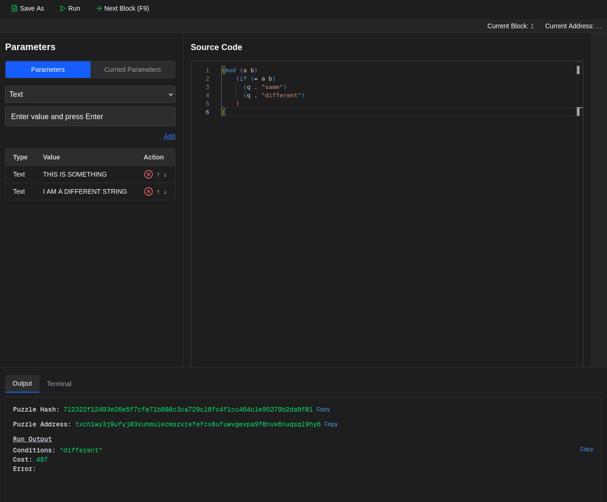

# Chia Simulator UI

A lightweight web-based command terminal to code in **chialisp** and interact with the **Chia Simulator** — designed for developers who want to test Chia smart contracts **without running a full node or using mainnet/testnet**.

---

## Requirements

- [Node.js](https://nodejs.org/) (for development, if modifying frontend)
- [Docker](https://www.docker.com/) (to run everything easily in a container)

## What This Is

This project wraps the [Chia Simulator](https://github.com/Chia-Network/chia-blockchain) in a Docker container and adds a **Next.js frontend** that acts as a terminal for executing Chia CLI commands directly.

It allows you to:

- Farm test blocks
- Query wallet addresses and balances
- Send simulated transactions
- Do all of this **without needing real XCH or internet access**
- experiment with chialisp using a web interface that can be optionally ran through the chia simulator.
---

## Why Use It?

-  **Fast startup** – launches a devnet node + wallet in seconds
-  **No fullnode required** – uses local simulator database
-  **Web-based terminal** – interact through a browser UI
-  **Great for dApp & Chialisp development**

---

## Build & Run

```bash
docker build -t chia-simulator-ui .
docker run --name sim -p 3000:3000 chia-simulator-ui
```

## How to Access It

Once the container is running, open your browser and go to: http://localhost:3000

